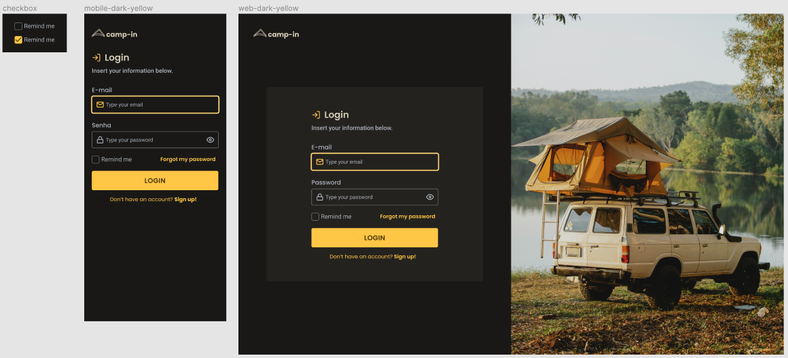

## Description

In this challenge, you will be creating a login form.

## Layout



## How to start?

1. Use the layout image as reference to your project.
2. All the images are in the `images` folder.
3. Remember that you can use the concepts learned in the previous lessons, like flexbox and grid.

## Requirements

- You must follow the layout.
- Use grid to create the layout of the page.
- Use flexbox to align the elements inside the grid.
- Use the correct semantic HTML tags and types.
- Inputs must have its own different styles, depending on the state.
- Add validation to the password. Up to you to decide what kind of validation.
- Make it responsive.

## Style Guide

```css
:root {
  --text-base: #afb6c2;
  --text-title: #d4ccb6;
  --background: #191816;
  --form-background: #24221f;
  --primary-color: #ffc632;
}
```

Fonts:

font-family: Poppins

font Weight: 400, 500 e 600

---

font-family: Roboto

Font Weight: 400 e 500

> You can find the fonts on [Google Fonts](https://fonts.google.com).
